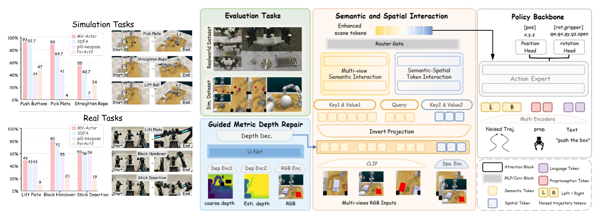

# MV-Actor: Multi-View Actor for Bimanual Manipulation

Evaluation code for MV-Actor on the bimanual PerAct2 / RLBench benchmark.



## Installation

Create a conda environment:

```bash
conda create -y --name mv_actor python=3.10
conda activate mv_actor
pip install torch torchvision torchaudio
pip install -r requirements-eval.txt
```

### Install RLBench

Install PyRep and CoppeliaSim for PerAct2:

```bash
git clone https://github.com/markusgrotz/PyRep.git
cd PyRep
wget https://downloads.coppeliarobotics.com/V4_1_0/CoppeliaSim_Edu_V4_1_0_Ubuntu20_04.tar.xz
tar -xf CoppeliaSim_Edu_V4_1_0_Ubuntu20_04.tar.xz
export COPPELIASIM_ROOT=$PWD/CoppeliaSim_Edu_V4_1_0_Ubuntu20_04
export LD_LIBRARY_PATH=$LD_LIBRARY_PATH:$COPPELIASIM_ROOT
export QT_QPA_PLATFORM_PLUGIN_PATH=$COPPELIASIM_ROOT
pip install -r requirements.txt
pip install -e .
cd ..
```

Install RLBench:

```bash
git clone https://github.com/markusgrotz/RLBench.git
cd RLBench
pip install -r requirements.txt
pip install -e .
cd ..
```

## Data Preparation

### PerAct2

Download pre-packaged PerAct2 data and test seeds using:

```bash
bash scripts/rlbench/peract2_datagen_fast.sh
```

The script downloads:

- PerAct2 zarr data: https://huggingface.co/katefgroup/3d_flowmatch_actor/resolve/main/peract2.zip
- PerAct2 test seeds: https://huggingface.co/katefgroup/3d_flowmatch_actor/resolve/main/peract2_test.zip

## MV-Actor Checkpoint

Download the MV-Actor checkpoint using:

```bash
bash scripts/weights/download_mv_actor_checkpoint.sh
```

If the GitHub repository is private, set `GITHUB_TOKEN` before running the script.

You can also download the checkpoint [here](https://github.com/TianYinchen56/MV-Actor/releases/download/v0.1-eval/best_iter200000_snapshot.pth).

SHA256:

```text
2b5655e217b20fada49ba6757e4158e276b04a504ad8d9bbaf8b28e5888f6793
```

For the original 3DFA baseline, download the official PerAct2 checkpoint [here](https://huggingface.co/katefgroup/3d_flowmatch_actor/resolve/main/3dfa_peract2.pth).

## CLIP Weights

Download the CLIP visual and text weights using:

```bash
bash scripts/weights/download_clip_weights.sh
```

Then set:

```bash
export CLIP_RN50_LOCAL_PATH=$PWD/third_party_weights/openai_clip/RN50.pt
export CLIP_HF_LOCAL_PATH=$PWD/third_party_weights/openai_clip_vit_base_patch32
```

## Pi3X Code and Weights

Clone the Pi3 repository:

```bash
git clone https://github.com/yyfz/Pi3.git third_party/Pi3
pip install -e third_party/Pi3
```

Download the Pi3X checkpoint using:

```bash
bash scripts/weights/download_pi3x_weights.sh
```

Then set:

```bash
export PI3_ROOT=$PWD/third_party/Pi3
export PI3X_CKPT=$PWD/third_party_weights/pi3x/model.safetensors
```

## Online Evaluation

Set paths:

```bash
export CKPT=$PWD/checkpoints/best_iter200000_snapshot.pth
export DATA_DIR=$PWD/peract2_raw/peract2_test
export CLIP_RN50_LOCAL_PATH=$PWD/third_party_weights/openai_clip/RN50.pt
export CLIP_HF_LOCAL_PATH=$PWD/third_party_weights/openai_clip_vit_base_patch32
export PI3_ROOT=$PWD/third_party/Pi3
export PI3X_CKPT=$PWD/third_party_weights/pi3x/model.safetensors
export COPPELIASIM_ROOT=/path/to/CoppeliaSim_Edu_V4_1_0_Ubuntu20_04
export RLBENCH_ROOT=/path/to/RLBench
export PYREP_ROOT=/path/to/PyRep
```

Run PerAct2 evaluation:

```bash
bash online_evaluation_rlbench/eval_peract2.sh
```

The full evaluation arguments are in:

```text
online_evaluation_rlbench/run_eval_mv_actor_alltasks.sh
```

Evaluation logs are written to:

```text
outputs/mv_actor_eval_<timestamp>/
```

## Code

```text
scripts/rlbench/peract2_datagen_fast.sh
scripts/weights/download_mv_actor_checkpoint.sh
scripts/weights/download_clip_weights.sh
scripts/weights/download_pi3x_weights.sh
online_evaluation_rlbench/eval_peract2.sh
online_evaluation_rlbench/run_eval_mv_actor_alltasks.sh
online_evaluation_rlbench/evaluate_policy.py
online_evaluation_rlbench/evaluate_policy_inprocess_pi3x.py
online_evaluation_rlbench/pi3x_worker.py
modeling/
datasets/
utils/
```

## Citation

If you find MV-Actor useful for your research, please consider citing:

```bibtex
@article{mv_actor,
  author = {Tian, Yinchen and Li, Huan and Peng, Muyao and Wang, Xi and Wang, Yan and Yang, You},
  title = {MV-Actor: Aligning Multi-View Semantics and Spatial Awareness for Bimanual Manipulation},
  journal = {Arxiv},
  year = {2026},
  url = {https://arxiv.org/abs/2606.10899}
}
```

This codebase is based on [3D FlowMatch Actor](https://github.com/nickgkan/3d_flowmatch_actor) and uses the [PerAct2](https://bimanual.github.io/) / [RLBench](https://github.com/stepjam/RLBench) benchmark. Please also cite:

```bibtex
@article{3d_flowmatch_actor,
  author = {Gkanatsios, Nikolaos and Xu, Jiahe and Bronars, Matthew and Mousavian, Arsalan and Ke, Tsung-Wei and Fragkiadaki, Katerina},
  title = {3D FlowMatch Actor: Unified 3D Policy for Single- and Dual-Arm Manipulation},
  journal = {Arxiv},
  year = {2025}
}
```

```bibtex
@article{grotz2024peract2,
  author = {Grotz, Markus and Shridhar, Mohit and Chao, Yu-Wei and Asfour, Tamim and Fox, Dieter},
  title = {PerAct2: Benchmarking and Learning for Robotic Bimanual Manipulation Tasks},
  journal = {Arxiv},
  year = {2024}
}
```

```bibtex
@article{james2019rlbench,
  title = {RLBench: The Robot Learning Benchmark \& Learning Environment},
  author = {James, Stephen and Ma, Zicong and Rovick Arrojo, David and Davison, Andrew J.},
  journal = {IEEE Robotics and Automation Letters},
  year = {2020}
}
```
